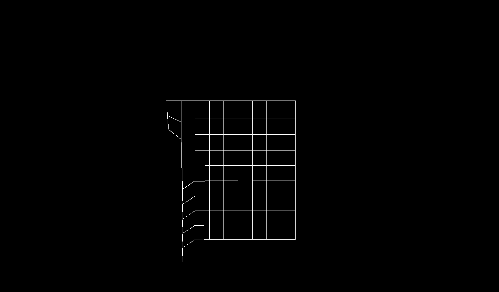

# Cloth



## Description

Cloth physics simulation in rust. Inspired by https://youtu.be/RjPBtxIupQA?si=16308gifiIwIsxrD

## Installation

```sh
git clone https://github.com/ralphvw/cloth.git
cd yourproject
```

## Usage

```sh
cargo run
```

## License

MIT.
